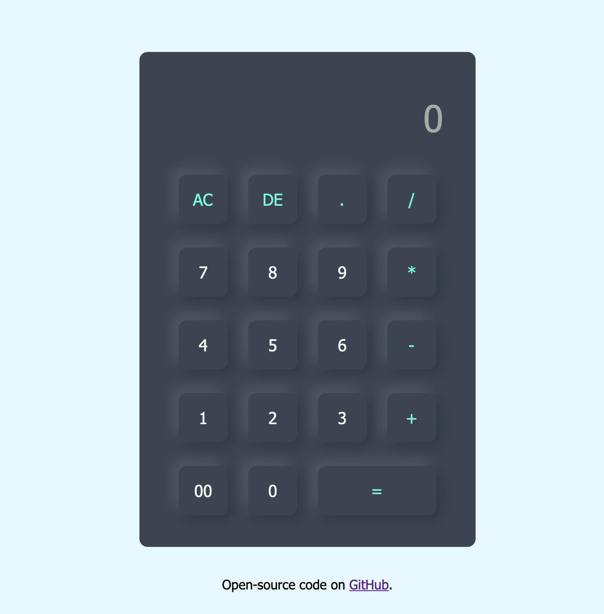

# Calculator Application

## Overview

A simple web-based calculator built using HTML and CSS. The application performs basic arithmetic operations through an interactive user interface.

## Technologies

- HTML5
- CSS3
- JavaScript

## Project Structure

```text
Calculator-App/
│
├── index.html
├── style.css
├── calculator.png
└── README.md
```

## Installation and Setup

### Clone the Repository

```bash
git clone https://github.com/Salmah1/Calculator-App.git
cd Calculator-App
```

### Run the Application

Open `index.html` in your web browser.

## How to Use

- Click the number buttons to enter values.
- Use the operator buttons (`+`, `-`, `*`, `/`) to build calculations.
- Press **=** to calculate the result.
- Press **AC** to clear the display.
- Press **DE** to delete the last entered character.

## Screenshot


